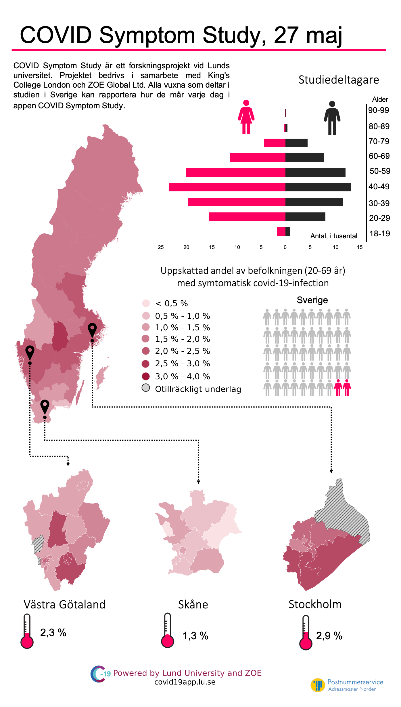
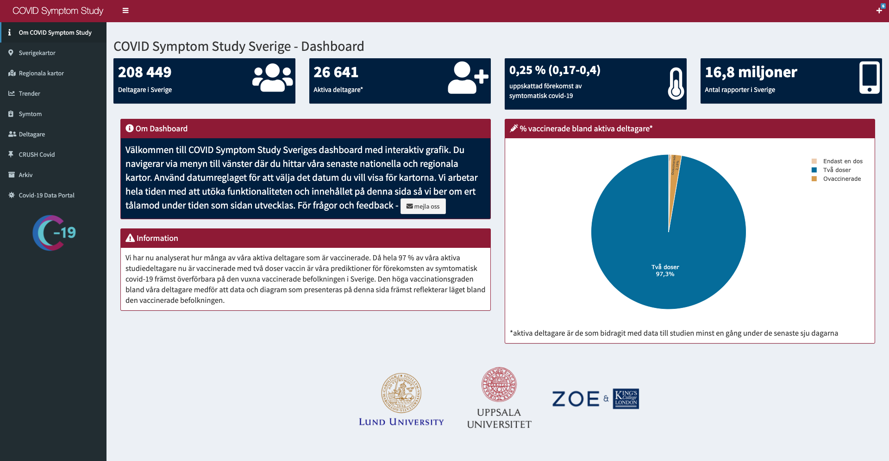
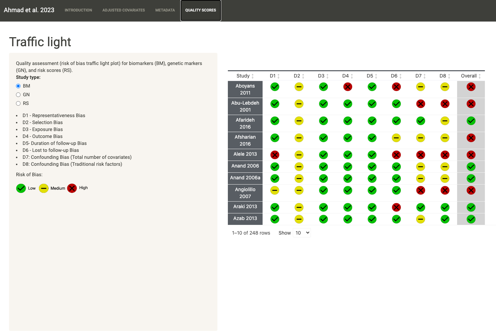
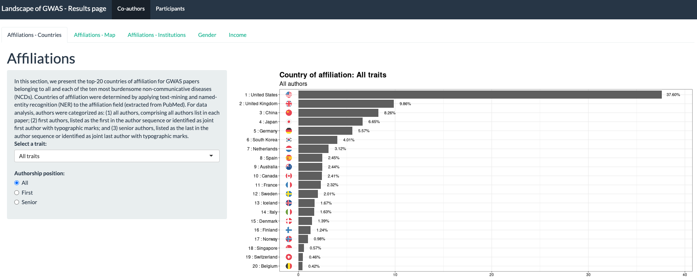
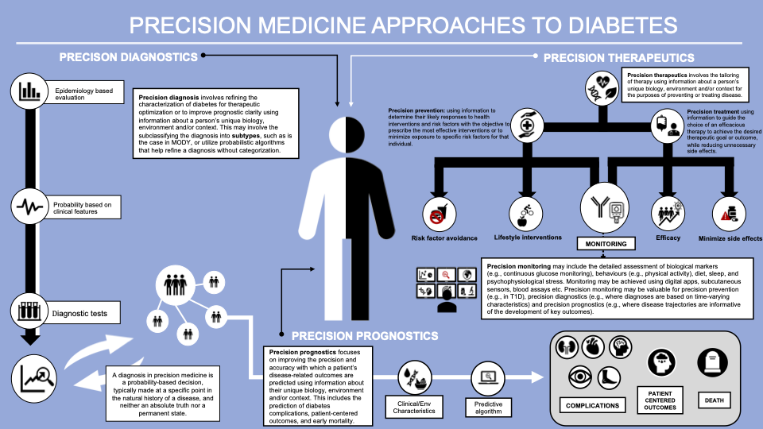

# Data visualization portfolio

This repository contains a curated collection of visualizations that I
created for academic, self-learning, and hobby purposes.

## COVID Symptom Study Sweden (CSSS)

The COVID Symptom Study was a non-commercial project that used a free
smartphone app to facilitate real-time data collection of symptoms,
exposures, and risk factors related to COVID-19. The app was developed
by researchers at King’s College and Guys and St Thomas’ Hospitals in
London in partnership with the health science company Zoe Global
Ltd. Baseline data and recurring daily questions are described in
<a href="https://science.sciencemag.org/content/368/6497/1362">Drew et
al. (Science, 2020)</a>. The app was launched in the UK and US in March
2020. In Sweden, the study is based at Lund University and, as per a
collaboration agreement on July 28, 2020, Uppsala University. More about
the Swedish part of the study is described in
<a href="https://www.nature.com/articles/s41467-022-29608-7">Kennedy &
Fitipaldi, et al. (Nat Comms, 2022)</a>. The app was launched in Sweden
on April 29, 2020, as part of a national research initiative on
COVID-19. Over 4.5 million participants in the three countries used the
app, approximately 220,000 of whom live in Sweden. On July 11, 2022,
with over 500 million data entries, in which Swedish participants
contributed approximately 20 million, the project officially ended the
data collection phase.

- **Maps and infographics**

During the early stages of the project, I primarily produced maps,
plots, and infographics for the CSSS. Most of these can be found in our
<a href="https://www.covid19app.lu.se/artikel/forsta-kartorna-fran-svenska-covid-symptom-study">data
archive</a>. The visualizations were released weekly and aimed to inform
our participants, Swedish policymakers, and the general public about our
findings. To facilitate the comprehension of our research results to a
broad audience, I experimented with different visualization styles, such
as infographics:

The maps, plots, and infographics that I produced for the CSSS were
featured in several Swedish media outlets:

[Aftonbladet](https://www.aftonbladet.se/nyheter/a/rA2R90/ny-forskarstudie-kan-hitta-corona-hotspots-i-sverige),
[Expressen](https://www.expressen.se/kvallsposten/unik-karta-visar-har-finns-flest-smittade/),
[Forskning&Framsteg](https://fof.se/artikel/app-for-covid-19-varnar-for-nya-utbrott/),
[Sydsvenskan](https://www.sydsvenskan.se/2020-05-27/ny-studie-covid-19-sprids-langsamt-i-skane-och-takten-avtar),
[TV4](https://www.tv4.se/klipp/va/12840270/ny-app-hjalper-forskare-i-kampen-mot-corona).

- **CSSS Dashboard**

On July 22, 2020, we launched the CSSS dashboard, an interactive online
solution for presenting our predictions and maps, entirely developed in
R shiny and deployed on shinyapps.io.

The source code for the dashboard is openly available
[here](https://github.com/hugofitipaldi/CSSS_dashboard).

The dashboard is available
[here](https://csss-resultat.shinyapps.io/csss_dashboard/).

## Publications

- **Precision Prognostics for CVD in T2D: Interactive Results**

I have created an interactive online solution for presenting the results
of the study “Precision prognostics for cardiovascular disease in Type 2
diabetes: a systematic review and meta-analysis.” This study conducted a
comprehensive review and meta-analysis to identify potentially novel
prognostic factors that may improve CVD risk prediction in T2D. The
study was led by Abrar Ahmad et al., and published in Communications
Medicine in 2024. The full paper can be accessed here.

- **GWAS mining results page (dashobard)**

I built this dashboard as a results page for one of my PhD publications.
More details about this project can be found in [Fitipaldi & Franks (Hum
Mol Gen,
2022)](https://academic.oup.com/hmg/advance-article/doi/10.1093/hmg/ddac245/6747418?login=false)

The application was written in R using the shiny package and is hosted
on shinyapps.io. The source code for the dashboard is openly available
[here](https://github.com/hugofitipaldi/gwas_mining/tree/main/restults_page).

The dashboard is available
[here](https://hugofitipaldi.shinyapps.io/gwas_results/).

- **Precision Medicine Diabetes Initiative**

I was invited to create this infographic and other figures featured in
the published consensus report: Precision medicine in diabetes: a
Consensus Report from the American Diabetes Association (ADA) and the
European Association for the Study of Diabetes (EASD),
<a href="https://link.springer.com/article/10.1007/s00125-020-05181-w">Chung,
W.K., Erion, K., Florez, J.C. et al. (Diabetologia, 2020)</a>.

